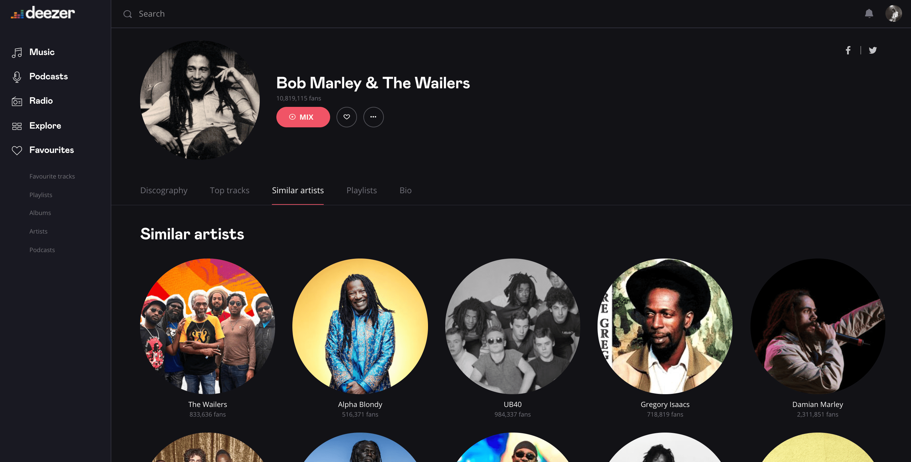

# Cold Start Similar Artists Ranking with Gravity-Inspired Graph Autoencoders


This repository provides code and data to reproduce results from the article [Cold Start Similar Artists Ranking with Gravity-Inspired Graph Autoencoders](https://arxiv.org/pdf/2108.01053.pdf), published in the proceedings of the 15th ACM Conference on Recommender Systems ([RecSys 2021](https://recsys.acm.org/recsys21/)).


## Recommending Similar Artists on Music Streaming Services 

On an artist’s profile page, music streaming services such as [Deezer](https://www.deezer.com/) frequently recommend a ranked list of _"similar artists"_ that fans also liked. However, implementing such a feature is challenging for new artists, for which usage data on the service (e.g. streams or likes) is not
yet available. In Section 3 of our paper, we model this cold start similar artists ranking problem as a _directed link prediction task_ in a directed and attributed graph, connecting artists to their top-_k_ most similar neighbors and incorporating side musical information.
Then, we address this task by learning node embedding representations from this graph, notably by leveraging [gravity-inspired graph (variational) autoencoders](https://github.com/deezer/gravity_graph_autoencoders/) models.

<div align="center">
    
</div>


## Datasets

In the `data` repository, we release two datasets associated to this work, and detailed in Section 4.1.1 of the paper.

#### Directed graph `deezer_graph.csv`

This file provides a directed graph dataset of 24 270 artists from the Deezer catalog. Each artist points towards 20 other artists. They correspond, up to
internal business rules, to the top-20 artists from the same graph that would be recommended in production in our  _"Similar Artists"_ feature. Due to confidentiality constraints, artists are unfortunately anonymized. 

Each row  corresponds to a directed edge from an artist `i` to an artist `j` in the format `(id_i, id_j, S_ij)`. The edge weight `S_ij` denotes the similarity score of `j` with respect to `i`, as described in the paper.

#### Descriptive features `deezer_features.csv`

This file provides descriptions of these artists, as detailed in Section 4.1.1. Specifically, each artist `i` is described by a 56-dimensional feature vector:
- the first column of `deezer_features.csv` corresponds to artist ids;
- the next 32 columns correspond to the _music genre_ embedding vector of each artist;
- the next 20 columns correspond to the _country_ indicator vector of each artist. Countries are anonymized;
- the last 4 columns correspond to the _music mood_ vector of each artist.

In our experiments, the top-80% of artists ids are _train_ artists. The next 10% correspond to _test_ artists and the last 10% to _validation_ artists.
Train artists are ranked by popularity on Deezer, i.e. artist `1` from the dataset is the most popular artist from the graph.

## Experiments

#### Installation 

```Bash
git clone https://github.com/deezer/similar_artists_ranking
cd similar_artists_ranking
python setup.py install
cd src
```

Requirements: python 3, networkx, numpy, scikit-learn, scipy.


#### Run experiments

The following command will execute experiments corresponding to Table 1 from the paper and report all Recall@K, MAP@K and NDCG@K scores:

```Bash
python main.py
```

Various options can be changed in the `option.py` file.

We re-compute the following methods from scratch: Popularity, Popularity-Country, In-Degree, In-Degree by Country, K-NN, K-NN+Popularity, K-NN+In-degree.

Regarding the DEAL, DropoutNet, STAR-GCN and SVD-DNN methods, we provide representative pre-computed node embedding vectors (that we obtained from models trained on Deezer internal usage data on train artists) in the `embeddings` folder. Then, we re-compute scores<sup>[1](#myfootnote1)</sup> obtained from these embedding vectors.

<sub><sup><a name="footnote1">1</a>: Note: as these methods include _random_ components during training, scores from Table 1 are actually averaged over 20 model trainings with different neural initializations. Scores obtained from the specific embeddings provided in `embeddings` will therefore slighly deviate from these averages.</sup></sub>

#### To do list

Standard, Source-Target, and Gravity GAE/VGAE will be added in the repository in the upcoming days.


## Cite

Please consider citing our paper if you use these datasets in your own work:

```BibTeX
@inproceedings{salha2021coldstart,
  title={Cold Start Similar Artists Ranking with Gravity-Inspired Graph Autoencoders},
  author={Salha-Galvan, Guillaume and Hennequin, Romain and Chapus, Benjamin and Tran, Viet-Anh and Vazirgiannis, Michalis},
  booktitle={Fifteenth ACM Conference on Recommender Systems},
  pages={443--452},
  year={2021}
}
```
